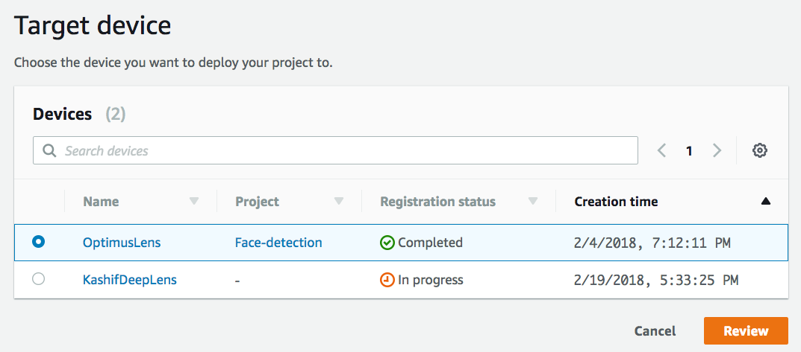

# Object Detection Using Deep Lens

## Module Objective
In this section of the workshop, we are going to use one of the AWS DeepLens sample projects to demonstrate the ability to deploy a pre-trained model to your DeepLens.  The sample projects all use pre-trained models where all you have to do is create the project, import the project, deploy the project and then run the project.  An alternative to this is importing and deploying a custom trained model which is explored in the optional module. 

Project Information:

  
## Create Your Project

1. Using your browser, open the AWS DeepLens console at https://console.aws.amazon.com/deeplens/.
2. Sign in to the console using the ID & credentials provided as part of the workshop.
3. Choose **Projects** from the left hand menu, then choose **Create new project**.
   *Reminder: For this workshop your device has been pre-registerd.  If you choose 'Devices' from the left hand menu, you will see your pre-registered device (Example: Labuser1)*

4. On the Choose project type screen
 - Choose **Use a project template**, then choose **Object detection**

    
- Scroll to the bottom of the screen, then choose **Next**.

5. On the Specify project details screen:
   - In the Project information section:
      - **Project Name:**  object-detection-**your-initials**

        *(Example: object-detection-sde)*
      - **Description:** Either accept the default description for the project, or type a description you prefer.

   - Scroll to the bottom, click **Create**

This returns you to the Projects screen where the project you just created is listed with your other projects.

## Deploy your project

Next you will deploy the Object Detection project you just created to your DeepLens.

1. From Deeplens console, On the Projects screen, choose the radio button to the left of your project name, then choose **Deploy to device**.

2. On the Target device screen, from the list of AWS DeepLens devices, choose the radio button to the left of the device that you want to deploy this project to. An AWS DeepLens device can have only one project deployed to it at a time so you should deploy to the DeepLens device noted in the DeepLens Box (Example: LabUser*n*)

3. Click **Review.**

   This will take you to the Review and deploy screen.

   If a project is already deployed to the device, you will see an error message
   "There is an existing project on this device. Do you want to replace it?
   If you Deploy, AWS DeepLens will remove the current project before deploying the new project."

4. On the Review and deploy screen, review your project and click **Deploy** to deploy the project.

   This will take you to to device screen, which shows the progress of your project deployment.  You will see a status message on the top of the screen once the model has been successfully deployed. 

## View your project output

AWS DeepLens produces two output streams: 

1. **Device Stream:** This is unprocessed video stream
2. **Project Stream:** The result of the processing that the model performs on the video frames

Options for viewing the output include viewing the stream message data as well as viewing the video stream.  Each option is outlined in detail in the [DeepLens Developer Guide under Viewing AWS DeepLens Output Streams](https://docs.aws.amazon.com/deeplens/latest/dg/deeplens-viewing-output.html).  

For this lab we are going to view the JSON-formatted output via the AWS IoT Console using the instructions below.  You can optionally follow the steps in the console for viewing video output assuming pre-requisites are met but in the interest of time to complete the workshop we are recommending the JSON-formatted output. 

## View your project log messages in IoT

You can also view the log messages that your project's Lambda function running on DeepLens device sends to IoT topic.

1. Go to DeepLens in AWS console and then Devices at https://console.aws.amazon.com/deeplens/home?region=us-east-1#devices

2. Click on the name of your DeepLens device and on the next screen under **Project output** you will see a *copy* button next to topic that is unique to your registered device.  

   Click **Copy**

3. Under Step #2 under Project output, click on the go to **AWS IoT Console** console link. 

4. Paste the topic copied previously in the **Subscription topic** input field.  Leave the other fields under Subscribe as defaults. Click **Subscribe to topic**

5. You should now see log messages published from the DeepLens device to IoT.

6. Feel free to move the camera around and watch the console message to see how accurately your model is detecting objects in the room. 

## Completion
You have created and deployed the built-in object detection project to your Deeplens device.