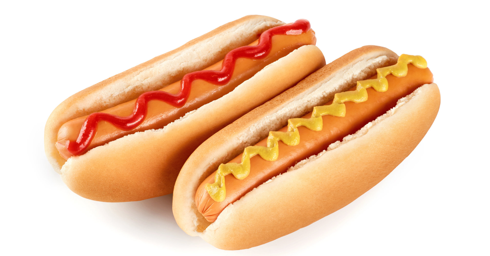

# Deploy a SageMaker trained model to your DeepLens

## Module Objective
In this section of the workshop, we are going to train a custom model using Amazon SageMaker and then deploy that model to
AWS DeepLens for inference at the edge.  We are going to use MXNet Deep Learning framework with a pretrained [SqueezeNet](https://arxiv.org/abs/1602.07360) image classification model to build/train our own 
classifier for identifying hot dogs. 

The basic steps involved include: 

1. **Model Training:** Training your model using Amazon SageMaker and export model artifacts to S3
2. **Import Model to AWS DeepLens:** Import your model artifacts from S3 and deploy it to your AWS DeepLens device
3. **Evaluate Model Performance:** Evaluate your model using hot dog pictures

 
## Model Training

1. Using your browser, open the Amazon SageMaker console at https://console.aws.amazon.com/sagemaker/.
2. Sign in to the console using the ID & credentials provided as part of the workshop.
3. Choose **Notebook Instances** from the left hand menu, then choose **Open Jupyter** next to the notebook you created in the earlier lab
4. Follow the steps outlined in [**STEP 3. Import and configure an external notebook**](https://aws.amazon.com/getting-started/tutorials/build-deeplens-project-sagemaker/) to *Import and configure an external notebook*

## Import Model to AWS DeepLens

 1. Follow the steps outlined in [**STEP 4. Import the model to AWS DeepLens**](https://aws.amazon.com/getting-started/tutorials/build-deeplens-project-sagemaker/) to *Import and configure an external notebook*
 
 *Note:* When importing the model choose MXNet as the **Model Framework**

## Evaluate Model Performance
